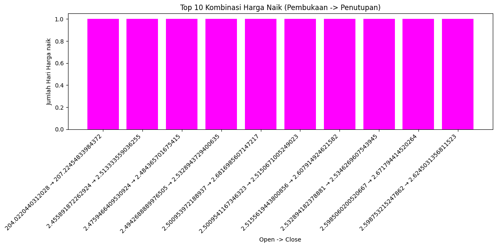
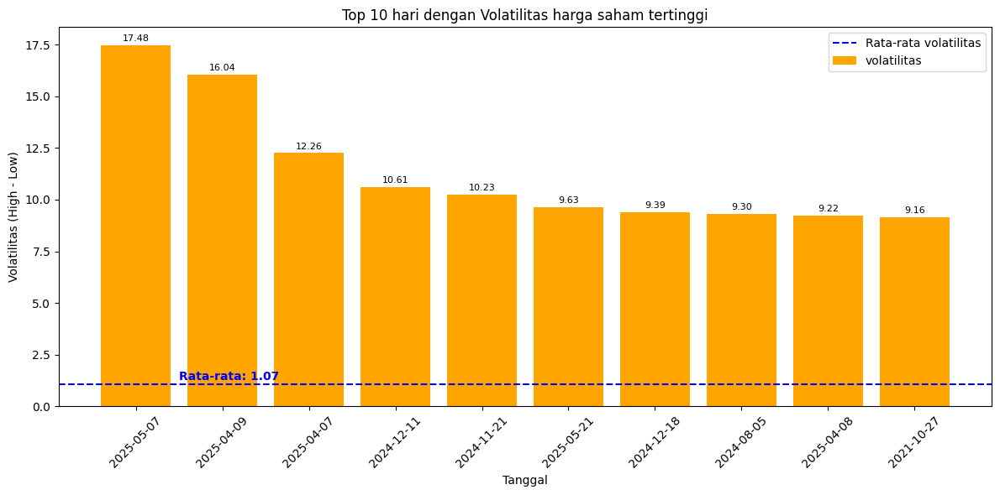
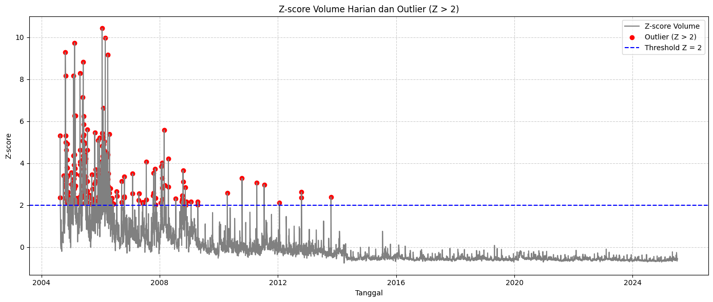

# 📈 Introduction

Explore the dynamic world of stock market analytics through Google’s historical stock data! This project uncovers 📊 monthly price trends, 🔍 daily market behavior, 📉 volume anomalies, and 📅 weekday vs. weekend trading patterns — all to understand how Google stock moves, when it spikes, and what patterns traders can watch for.

# 💻 Background

Saat ini saya sedang mempelajari pendekatan exec-driven question sebagai bagian dari proses analisis data yang lebih strategis. Pendekatan ini berfokus pada penyusunan pertanyaan yang dapat menjawab kebutuhan pemangku keputusan di level eksekutif. Alih-alih bertanya tentang hal-hal teknis, saya mencoba menyusun pertanyaan yang berorientasi pada insight, pola, dan peluang, seperti tren harga saham, perilaku pasar mingguan, volume transaksi ekstrem, dan kecenderungan arah harga. Dengan begitu, setiap analisis yang saya lakukan bisa mengarah langsung pada rekomendasi atau aksi nyata di level bisnis atau manajemen.

Data berasal dari [Link from kaggle](https://www.kaggle.com/datasets/adilshamim8/google-stocks-historical-data) -- Data saham google(clean dataset). Data ini penuh dengan insight seputar harga pembukaan, penutupan, harga tertinggi dan terendah serta volume transaksi(perdagangan) dalam harga saham.

#### Found the visualization in here below:

- Python [Link Visualization](https://colab.research.google.com/drive/13jr2hfCycFhtcn2yufgDn9q6tdwlvNjC?usp=sharing)
- SQL QUERY ? [Project](GOOGLE_PROJECT/sql_project_query)

### The question i wanted to answer to answer through any SQL queries were (exec-driven question) :

1. Bagaimana pola pergerakan rata-rata harga penutupan saham Google dari waktu ke waktu?
2. Seberapa sering saham Google ditutup dengan harga lebih tinggi dibanding saat pembukaan?
3. Hari dalam seminggu mana yang menunjukkan fluktuasi harga saham paling signifikan?
4. Di bulan apa aktivitas perdagangan saham Google mencapai puncaknya?
5. Apakah terdapat kecenderungan harga saham naik di awal minggu atau justru di akhir minggu?
6. Dalam sehari perdagangan, apakah saham Google lebih sering mengalami kenaikan atau penurunan harga?
7. Apakah terdapat hari-hari tertentu dengan lonjakan volume transaksi yang tidak biasa?

# Tools I used

For my deep dive into the google stock data analysis, I harnessed the power of several key tools :

- **SQL:** The Backbone of my analysis, allowing me to query the database and unearch critikal insights.
- **PostgreSQL:** The chosen database managemen system, ideal for handling the job posting data.
- **Visual Studio Coda:** My go-to for database management and executing SQL queries.
- **Python (for visualization):** To create the chart and priventing insight with chart
- **Git&Github:** Essential for version control and sharing my Sql scripts and analysis, ensuring collaboration and project tracking.

### The Analysis

Each query for this project aimed at investigating specific aspects of the data analyst google stock data(saham google).
Here's how I approached each Question:

### 1. Bagaimana pola pergerakan rata-rata harga penutupan saham Google dari waktu ke waktu?

Tren harga rata-rata penutupan ini diambil rentang tahun (2024-2025) dalam rentang bulan (Top 20 bulan) dengan harga rata-rata tertinggi dalam satuan USD.

```sql
SELECT
    EXTRACT(YEAR FROM date) as year,
    EXTRACT(MONTH FROM date) as month,
    avg(close) as avg_penutupan_harga
FROM
    google_stock
group BY
     EXTRACT(YEAR FROM date),
     EXTRACT(MONTH FROM date)
order BY
  year desc, month desc
  limit 20;
```

Here's the breakdown insight of the top 20 average closing price at google stocks data in 2024-2025:

- 📈 Harga penutupan saham Google menunjukkan tren kenaikan stabil dari akhir 2024, dan mencapai puncaknya pada Januari 2025 di angka **±196 juta USD**.
- 📉 Setelah puncak tersebut, terjadi koreksi signifikan hingga mencapai titik terendah di bulan April 2025 (**~156 juta USD%%), yang kemungkinan disebabkan oleh aksi ambil untung (**profit-taking\*\*) investor.
- 🔄 Harga kembali naik pada pertengahan 2025 dan menunjukkan sinyal pemulihan (rebound), menandakan bahwa sentimen pasar tetap positif meski sempat terkoreksi.
- 📊 Perbedaan harga antar bulan yang cukup ekstrem (**±40 juta USD**) mencerminkan volatilitas tinggi, sehingga periode ini berisiko sekaligus menarik untuk strategi trading jangka pendek.


_Grafik menampilkan tren harga penutupan rata-rata saham Google dalam satuan juta USD selama periode bulan-bulan tertentu (kemungkinan rentang 2024–2025). Data yang diambil adalah 20 bulan dengan rata-rata harga tertinggi (top 20)._

#### Langkah Rekomendasi

1. Investor jangka pendek dapat mengambil peluang pada periode harga rendah untuk membeli sebelum rebound.
2. Analis pasar saham dapat mengkaji faktor fundamental (laporan keuangan, produk baru, earnings call) yang memicu lonjakan harga awal 2025.
3. Jika pola naik–koreksi–rebound ini berulang tiap tahun, maka strategi seasonal investing bisa diterapkan.

### 2. Seberapa sering saham Google ditutup dengan harga lebih tinggi dibanding saat pembukaan?

Disini saya ingin mengetahui seberapa sering saham google ditutup dengan harga yang lebih tinggi dibanding dengan harga pembukaannya.

[Sentiman positif pasar](sql_project_query/2_sentimen_positif_pasar.sql)
This insight highlights the number of trading days where the stock showed a positive daily performance — a signal often associated with bullish sentiment or investor confidence on that day.

Here's the breakdown insight of how often Google stock closed higher than it opened during the 2024–2025 period:

- Selama periode, saham Google ditutup dengan harga lebih tinggi dari harga pembukaan pada **50,75%** per hari perdagangan.
- Hal ini menunjuk-kan bahwa sentimen pasar secara umum cenderung positif secara _intraday_, walaupun tidak dominan secara signifikan(bahkan mendekati netral).
- Kombinasi harga pembukaan dan penutupan paling sering menunjukan tren kenaikan, dimana ini menunjukan minat beli yang kuat hingga akhir sesi.


_Persentase hari harga naik: 50.75% dari total 5255 hari perdagangan. Bar chart juga menunjukan penutupan harga saham selalu lebih besar dibandingikan dengan pembukaan harga saham_

#### Langkah Rekomendasi

- Untuk trader harian dapat mempertimbangkan strategi "buy at open, sell at close" sebagai pendekatan dasar, dimana tetap perlu diperhatikan dengan indikator teknik lainnya karena indikator kenaikannya hanya sedikit diatas 50%.
- Melakukan analisis lanjutan untuk melihat pola mingguan atau bulanan, seperti contoh (senin lebih bullish daripada jumat).

### 3. Hari apa saja dalam seminggu yang menunjukkan fluktuasi harga(volatilitas) saham paling signifikan?

Pada pertanyaan ini, saya ingin mengetahui top 10 tingkat fluktuasi harga(volatilitas) harga saham yang paling signifkan terjadi di hari(dalam seminggu) dan terjadi pada bulan apa dalam rentang tahun 2024-2025.
[SQL Query](sql_project_query/3_volatilitas_tertinggi.sql)

Here's the breakdown insight of which weekdays show the most significant price volatility in Google stock during the 2024–2025 period:

- 📊 Terlihat ada hari-hari dengan volatilitas harga harian(selisih hig-low) jauh diatas rata-rata(lebih dari 9x lipat),contoh pada 7 mei 2025, volatilitas mencapai **17.48 poin** jika dibandingkan dengan daily average yg hanya **1.07 poin**
- Beberapa hari menunjukan volatilitas tinggi secara berdekatan seperti April-Mei 2025, ini menandakan sebuah potensi adanya peristiwa pasar yg besar atau reaksi investor terhadap informasi eksternal(earning reports dll)
- Volatilitas yg tinggi menjadi sinyal peluang besar untuk trader aktif, tetapi ini juga berisiko tinggi jika tida diikuti dengan langkah yg tepat.

_Volatilitas ekstrem ini bisa menjadi alarm bagi investor untuk lebih waspada atau justru lebih aktif memanfaatkan peluang harga yang fluktuatif — tergantung pada profil risiko dan strategi investasi masing-masing._

_Bar chart menunjukan volatilitas harga harian(selisih hig-low) jauh diatas rata-rata(lebih dari 9x lipat),tepatnya pada 7 mei 2025, volatilitas mencapai **17.48 poin** jika dibandingkan dengan daily average yg hanya **1.07 poin**_

#### Langkah Rekomendasi

- Investor jangka pendek atau harian dapat memanfaatkan hari-hari dengan volatilitas tinggi untuk strategi intraday atau swing trading
- menganalisis apa yang terjadi pada hari-hari dengan volatilitas ekstrem, misalnya mengaitkannya dengan berita keuangan, laporan laba, atau sentimen pasar makro.

### 4('5'). Apakah terdapat kecenderungan harga saham naik di awal minggu atau justru di akhir minggu?

Pada pertanyaan kali ini saya ingin mengetahui apa ada kecenderungan harga saham untuk naik di awal minggu atau justrun naik di akhir minggu.

[early and last price query](sql_project_query/5_early&last_price.sql)

Here's the breakdown insight of which day show the most significant price in Google stock during period:

- Secara rata-rata harga saham google ditutup sedikit naik pada akhir minggu (jumat) sejumlah 50.76 juta USD dibandingkan dengan awal minggu (senin) sejumlah 50.62 juta usd


_Bar chart menunjukan rata-rata harga ditutup sedikit lebih tinggi pada akhir minggu (jumat) dengan 50.76 juta USD_

#### Langkah Rekomendasi

Investor jangka pendek dapat mempertimbangkan potensi penguatan harga di hari Jumat untuk mengatur waktu beli atau jual saham, terutama dalam strategi trading mingguan.

### 5('7'). Apakah terdapat hari-hari tertentu dengan lonjakan volume transaksi yang tidak biasa (outliers)?

Pada pertanyaan kali ini saya mencoba mencari tahu mengenai transaksi yang tidak wajar(outliers) pada aktivitas perdagangan harga saham pada **Google stock data**.

[high spike transaction](sql_project_query/7_outlier_volume_transaksi.sql)

Here's the breakdown insight of which day show the most spike transaction volume (outliers) in Google stock during period:

- Pada grafik menunjukan banyaknya lonjakan volume(outlier) yang signifikan antara tahun 2004-2008. **Z-Score** bahkan mencapai diatas 10, dimana ini menunjukan aktivitas perdagangan yg luar biasa tinggi.
- Setelah periode tahun 2008 jumlah outlier menurun drastis dan cenderung volume perdagangan lebih stabil pada tahun-tahun berikutnya, ini menunjukan pasar mulai lebih tenang dan terprediksi
- Setelah tahun 2015, hampir tidak ada lonjakan signifikan dan mencurikgakan. Sehingga aktivitas transaksi terjaga dengan pola distribusi yang cenderung normal.
  
  _Walaupun sempat mengalami volume transaksi yang signifikan pada tahun (2004-2008), pergerakan transaksi terlihat kembali stabil dimulai pada tahun 2015 dengan pola distribusi yang cenderung lebih normal dan terprediksi_

#### Langkah Rekomendasi

- Dikarenakan volume transaksi yang sangat tinggi investor atau trader sebaiknya tidak hanya melihat harga, tetapi juga volume sebagai indikator tekanan pasar.
- Pendekatan statistik **Z-score** dapat dimanfaatkan sebagai **early warning system** untuk mengidentifikasi aktivitas abnormal pada saham lainnya.

# Conclusion

### Key Insight

1. **Harga saham mencapai puncak pada awal 2024**
   Tren harga penutupan menunjukan peningkatan yang stabil sepanjang akhir 2024 dan mencapai titik tertinggi pada **januari 2025 (±196 juta USD)** sebelum mengalami koreksi/penurunan yang tajam.
2. **Separuh lebih hari perdagangan saham ditutup positif**
   Dalam periode 2024-2025, **50.75%** hari perdagangan saham google ditutup lebih daripada harga pembukaannya. Ini meng-indikasikan sentimen pasar harian yang positif dan relatif optimis.
3. **Volatilitas ekstream tertinggi pada 7 Mei 2025**
   Pada tanggal ini, selisih harga tertinggi dan terendah dalam sehari mencapai **17.48 poin** atau lebih dari **9x volatilitas harian**, yang patut dicermati oleh trader aktif.
4. **Harga penutupan lebih tinggi di akhir minngu**
   Rata-rata harga penutupan (**Close**) di hari jumat (**50.76 juta USD) sedikit lebih tinggi dibanding hari senin (**50.62 juta USD), ini bisa menjadi sinyal penguatan menjelang akhir pekan.
5. **Lonjakan volume perdagangan terbanyak terjadi di tahun 2004-2008**
   Periode ini menunjukan banyak outlier volume transaksi (Z-score>2), sementara setelah tahun 2015 volume menjadi jauh lebih stabil dan norma, yang menandakan kondisi pasar yang lebih tenang.

# Closing though

Proyek ini memperkuat kemampuan saya dalam menganalisis data pasar saham menggunakan SQL dan visualisasi python untuk mengidentifikasi pola harga, volatilitas, sentimen pasar, serta aktivitas transaksi yang tidak wajar pada saham Google. Melalui eksplorasi data historis ini, saya memperoleh wawasan berharga tentang bagaimana memanfaatkan data untuk mendukung keputusan investasi yang lebih terukur. Proyek ini juga menegaskan pentingnya pendekatan berbasis data dalam memahami dinamika pasar dan menunjukkan bahwa kemampuan analisis kuantitatif merupakan aset penting dalam dunia finansial yang terus berubah.
